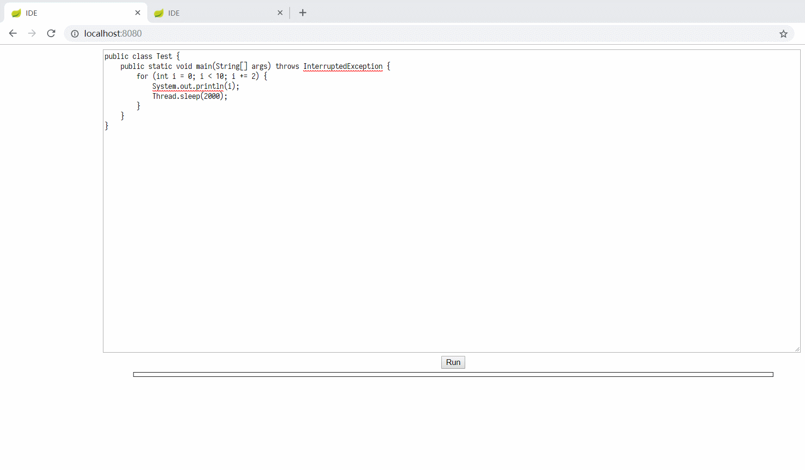
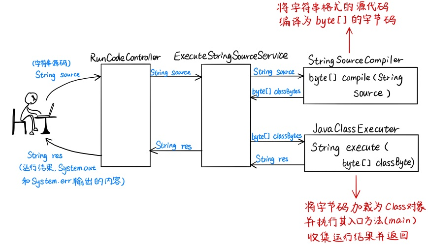
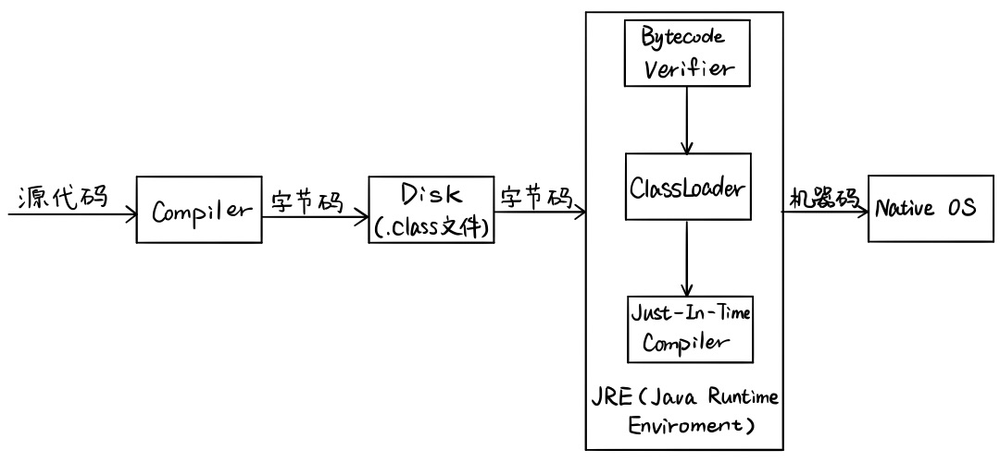
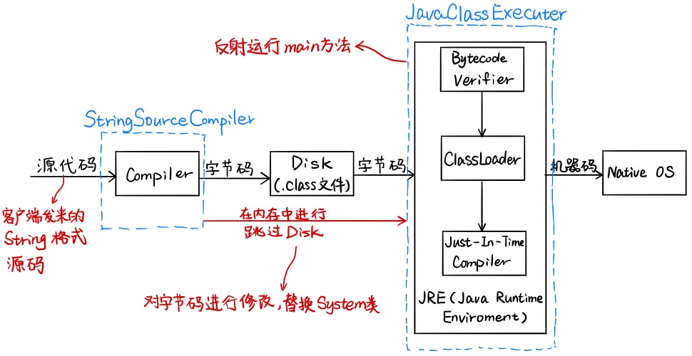

# 基于 SpringBoot 的在线 Java IDE

本项目基于 SpringBoot 实现了一个在线的 Java IDE，可以远程运行客户端发来的 Java 代码的 main 方法，并将程序的标准输出内容、运行时异常信息反馈给客户端，并且会对客户端发来的程序的执行时间进行限制。

项目中涉及的框架相关知识并不多，主要涉及了许多 Java 基础的知识，如：Java 程序编译和运行的过程、Java 类加载机制、Java 类文件结构、Java 反射等。除此之外，还涉及到了一个简单的并发问题：如何将一个非线程安全的类变为一个线程安全的类。因此，本项目较为适合在比较注重基础的面试中介绍给面试官，可以引出一些 Java 虚拟机，Java 并发相关的问题，较能体现应聘者对于 Java 的一些原理性的知识的掌握程度。在本篇文章中，我们尽可能的将用到的知识简单讲解一下或者给出讲解的链接，以方便大家阅读。

#### 运行效果

#### 涉及技术

- Java 动态编译
- Java 类文件的结构
- Java 类加载器 & Java 类的热替换
- Java 反射
- 如何将一个类变为线程安全类

#### 项目介绍

- **实现编译模块：** 使用动态编译技术，可将客户端发来的源代码字符串直接编译为字节数组；
- **实现字节码修改器：** 根据 Java 类文件结构修改类的字节码，可将客户端程序对 System 的调用替换为对 System的替代类 HackSystem 的调用；
- **实现运行模块：** 自定义类加载器实现类的加载 & 热替换，通过反射实现 main 方法的运行；
- **解决多用户同时发送执行代码请求时的并发问题：** 通过 ThreadLoacl 实现线程封闭，为每个请求创建一个输出流存储标准输出及标准错误结果；

## 项目实现流程

在线执行 Java 代码的实现流程如下图所示：

既然要运行客户端发来的 Java 代码，那么我们首先需要了解 Java 程序编译和运行的过程，然后仿照 Java 程序的真实运行过程来运行客户端发来的 Java 代码。

## Java 程序编译和运行的过程

我们先来看一下 Java 程序编译和运行的过程图：

如上图所示，要运行一个 Java 程序需要经过以下两个步骤：

- 源文件由编译器编译成字节码；
- 字节码由 Java 虚拟机解释运行。

也正是因为 Java 程序既要编译同时也要经过 JVM 的解释运行，所以说 Java 被称为半解释语言。接下来我们将对以上两个步骤进行详细说明。

### 编译

在运行前，我们首先需要将 .java 源文件编译为 .class 文件。Java 编译一个类时，如果这个类所依赖的类还没有被编译，编译器就会先编译这个被依赖的类，然后引用，否则直接引用，如果 Java 编译器在指定目录下找不到该类所其依赖的类的 .class 文件或者 .java 源文件的话，编译器话报“cant find symbol”的 Error。

### 运行

Java 类运行的过程可分为两个过程：

- **类的加载**
	- 应用程序运行后，系统就会启动一个 JVM 进程，JVM 进程从 classpath 路径中找到名为 Test.class 的二进制文件（假设客户端发来的类名为 Test），将 Test 的类信息加载到运行时数据区的方法区内，这个过程叫做 Test 类的加载。
	- 上一步过程主要通过 ClassLoader 完成，类加载器会将类的字节码文件加载为 Class 对象，存放在 Java 虚拟机的方法区中，之后 JVM 就可以通过这个 Class 对象获取该类的各种信息，或者运行该类的方法。
	- 关于类加载器的详细讲解可见：[虚拟机类加载机制](https://github.com/TangBean/understanding-the-jvm/blob/master/Ch2-Java%E8%99%9A%E6%8B%9F%E6%9C%BA%E7%A8%8B%E5%BA%8F%E6%89%A7%E8%A1%8C/01-%E8%99%9A%E6%8B%9F%E6%9C%BA%E7%9A%84%E7%B1%BB%E5%8A%A0%E8%BD%BD%E6%9C%BA%E5%88%B6.md)。
- **类的执行**
	- JVM 找到 Test 的主函数入口，开始执行 main 函数。
	- 本项目主要通过反射来完成这一过程，有关反射的详细讲解可见：[Java 反射](https://github.com/TangBean/SimpleSpring/blob/master/doc/011-%E5%8F%8D%E5%B0%84%E4%B8%8E%E5%86%85%E7%9C%81.md#%E5%8F%8D%E5%B0%84-reflect)。

在了解 Java 程序的实际运行过程之后，我们接下来要考虑的是：如何在运行过程中实现这一流程？也就是说，我们要在服务器端程序运行的过程中完成客户端代码发来的代码的编译和运行。通过对上图中 Java 程序编译和运行流程进行分析，我们得到以下客户端 Java 源代码执行流程：

通过观察上图可以发现，我们的重点在于实现 `StringSourceCompiler` 和 `JavaClassExecuter` 两个类。它们的作用分别为：

- `StringSourceCompiler`：将字符串形式的源代码 String source 编译成字节码 byte[] classBytes；
- `JavaClassExecuter`：将字节码 byte[] classBytes 加载进 JVM，执行其 main 方法，并收集运行输出结果字符串返回。

> **Note：** 我们只收集 `System.out` 和 `System.err` 输出的内容返回给客户端。

接下来，我们将对 `StringSourceCompiler` 和 `JavaClassExecuter` 类的实现方式进行详解。

## 实现编译模块：StringSourceCompiler

通过 JDK 1.6 后新加的动态编译实现 `StringSourceCompiler`，使用动态编译，可以直接在内存中将源代码字符串编译为字节码的字节数组，这样既不会污染环境，又不会额外的引入 IO 操作，一举两得。

具体实现以及原理说明详见：[动态编译](./doc/01-动态编译.md)。

## 实现运行模块：JavaClassExecuter

`JavaClassExecuter` 的实现分为以下几步：

- [执行字节码的入口方法（main 方法）](./doc/02-执行字节码的入口方法.md)
- 收集代码执行结果
	- [字节码修改器](./doc/03-收集代码执行结果：字节码修改器.md)
	- [实现 HackSystem](./doc/04-收集代码执行结果：实现HackSystem.md)

